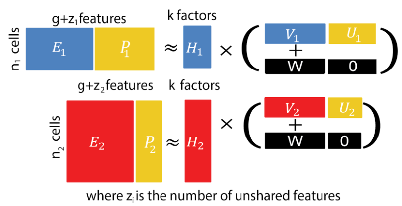

This vignette applies the UINMF algorithm
([Kriebel et al. 2021](http://dx.doi.org/10.1101/2021.04.09.439160))
implemented in the LIGER package to integrate the single-cell RNA
sequencing (scRNA-Seq) and the mass spectrometry-based single-cell
proteomics (MS-SCP) data. This data set is provided by the
`SingleCellMultiModal` package. The major advantage of using the
recently published UINMF algorithm is that it does not require that
the different modalities are acquired from the same cell and it can
include features that are specific to each modality.

# Load data

We use the `SCoPE2` function from the `SingleCellMultiModal` package
to retrieve the MS-SCP and scRNA-Seq data set. SCoPE2 refers to the
name of the acquisition protocol for MS-SCP data.

```{r, message = FALSE}
library(SingleCellMultiModal)
mae <- SCoPE2("macrophage_differentiation",
              modes = "rna|protein",
              dry.run = FALSE)
mae
```

The `mae` object contains two assays containing either the MS-SCP data
(`protein`) or the scRNA-Seq data (`rna`). Refer to the SCoPE2 vignette
(`vignette("SCoPE2", package = "SingleCellMultiModal")`) for more
information about the data set.

# RNA data Processing

We next need to prepare the data before integration. While the protein
data has already been extensively processed, the RNA data has
undergone only minimal processing. RNA data has already been filtered
for cells that pass QC, but still need to be processed in order to
select for highly variable features.

## Remove empty features

First, we remove features that were not detected. A gene is detected
if it has at least one count in at least one of the cells.

```{r}
sel <- rowSums(counts(mae[["rna"]]) > 0) > 0
table(sel)
```

About 30 % of the genes (10149 out of 32738) in the data were
not detected. We remove them.

```{r}
mae[["rna"]] <- mae[["rna"]][sel, ]
```

## Log-normalization

We used the `scuttle` package to normalization the scRNA-Seq data. This
is performed using the `logNormCounts`. Adding `transform = "none"`
will create a new data matrix containing the normalized counts before
log-transformation.

```{r}
library(scuttle)
mae[["rna"]] <- logNormCounts(mae[["rna"]], transform = "none")
mae[["rna"]] <- logNormCounts(mae[["rna"]])
```

Notice that two new data assay were added to the RNA assay, called
`normcounts` and `logcounts`.

```{r}
assays(mae[["rna"]])
```

# Features selection

## Highly variable genes

For the scRNA-Seq data, we select highly variable genes (HVG).
Those can be identified by modelling the gene-variance relationship
from the `logcounts` data. This is performed using the `modelGeneVar`
from the `scran` package.

```{r}
library(scran)
varModel <- modelGeneVar(mae[["rna"]])
```

This model decompose the gene variance into technical variability
(fitted trend) and biological variability (residuals).

```{r}
library(tidyverse)
ggplot(data.frame(varModel)) +
    aes(x = mean) +
    geom_point(aes(y = total)) +
    geom_line(aes(y = tech), colour = "red") +
    ylab("variance")
```

We filter the 2000 genes that have highest biological variability,
constraint to features with a false discover rate smaller than 0.3
(the hypotheses being the biological variability is greater than the
technical variability against there are no difference between the two
types of variability). We store the selection results in the data set.

```{r}
topHvg <- getTopHVGs(varModel,
                     n = 2000,
                     var.field = "bio",
                     fdr.field = "FDR",
                     fdr.threshold = 0.3)
rowData(mae[["rna"]])$top2000HVG <- rownames(mae[["rna"]]) %in% topHvg
```

## Highly variable proteins

For the MS-SCP data, we cannot model the mean-variance relationship
since the data already went through protein-wise normalization.
Therefore the distribution of the average protein expression is
centered around zero. We will only focus on the protein variance

```{r}
vars <- rowVars(assay(mae[["protein"]]))
hist(vars)
```

Although this approach is far from being perfect and highlight the
current lack of principled MS-SCP data processing workflows, we select
the top 2000 proteins that have highest variance.

```{r}
thres <- sort(vars, decreasing = TRUE)[2000]
rowData(mae[["protein"]])$top2000HVP <- vars >= thres
```

# Convert feature names

Before proceeding to the integration, we need to convert the features
names (genes and proteins) to a common naming. We decided to convert
to HGNC symbols because this type of annotation is easier to interpret
from downstream analysis results.

The conversion is performed using `biomaRt` and relying on the Ensembl
database. We use the human data base since cells in the data were
isolated from human cell line cultures.

```{r}
library(biomaRt)
human <- useMart("ensembl", "hsapiens_gene_ensembl")
```

The features names in the `rna` assay are already encoded as HGNC
symbols and so do not require additional processing.

```{r}
head(rownames(mae[["rna"]]))
```

The feature names in the `protein` assay are however encoded as Uniprot
protein IDs that does not match the symbols in the `rna` assay.

```{r}
head(rownames(mae[["protein"]]))
```

We therefore convert those proteins IDs to HGNC symbols. Note that
HGNC symbols are not available for all protein IDs, resulting in some
gene symbols to be `NA`. Proteins with unassigned HGNC symbols are
removed from the analysis.

```{r}
protIds <- rownames(mae[["protein"]])
conversion <- getBM(attributes = c("uniprot_gn_id", "hgnc_symbol"),
                    filters = "uniprot_gn_id",
                    values = protIds,
                    mart = human,
                    uniqueRows = TRUE)
rownames(mae[["protein"]]) <-
    conversion$hgnc_symbol[match(protIds, conversion$uniprot_gn_id)]
mae[["protein"]] <- mae[["protein"]][!is.na(rownames(mae[["protein"]])), ]
```

Now that the feature names for both modalities are encoded using the
same convention, we can check the overlap between the two assays.

```{r}
all <- union(rownames(mae[["rna"]]),
             rownames(mae[["protein"]]))
table(`in rna` = all %in% rownames(mae[["rna"]]),
      `in protein` = all %in% rownames(mae[["protein"]]))
```

# Export data

Export data to csv files for processing/exploring with third-paty tools.

(The code chunks below aren't evaluated)

```{r, eval = FALSE}
write.csv(colData(mae[["rna"]]), file = "../data/rna_sample_annotation.csv")
write.csv(colData(mae[["protein"]]), file = "../data/protein_sample_annotation.csv")
```

```{r, eval = FALSE}
write.csv(assay(mae[["rna"]]), file = "../data/rna_expression.csv")
write.csv(assay(mae[["protein"]]), file = "../data/protein_expression.csv")
```


# Integrate scRNA-Seq and MS-SCP data

The integration performed in this vignette uses the UINMF algorithm
described in [Kriebel et al. 2021](http://dx.doi.org/10.1101/2021.04.09.439160).
The algorithm decomposes the data ($[E_1, P_1]$ and [E_2, P_2]) in
different latent components. The underlying model is illustrated in
this figure taken from the original article.

```{r, echo = FALSE}

```

- The $H_1$ and $H_2$ components contain the latent factors that
describe the cell space.
- The $W$ component contains the latent factors in the feature space that
are shared across modalities.
- The $V_1$ and $V_2$ components capture the specific effects in each modality on the feature
expression are specific to their corresponding modality.
- The $U_1$ and $U_2$ matrices contain the latent feature space only
for the unshared features, that are features found only in one
of the modalities

The UINMF algorithm is available from the `rliger` package 
(previously named `liger`under the `U_algorithm` branch of the GitHub repository).

```{r, message = FALSE}
## BiocManager::install("welch-lab/liger")
library(rliger)
```

## Create the LIGER object

The LIGER package implements its own data structure. We therefore
need to create a `liger` object from the `mae` object. Since the data
are easily accessible, this conversion is straightforward to perform.
Note, that we don't use the log-transformed data but rather the data
on the count scale. This is because we here assume that the biological
processes can be modelled by additive effects. This assumption would
not hold when integrating the data in logarithmic scale. We therefore
extract the normalized counts for the scRNA-Seq data and exponentiate
the MS-SCP data.


```{r}
lig <- createLiger(list(rna = normcounts(mae[["rna"]]),
                        protein = 2^assay(mae[["protein"]])),
                   make.sparse = TRUE,
                   take.gene.union = FALSE,
                   remove.missing = TRUE)
```

Normalize data by dividing by the summed expression per cell.

```{r}
lig <- rliger::normalize(lig)
```


## Define shared and unshared features

We will here tell the UINMF algorithm which features are shared across
modalities and which features are specific of modality. We retrieve
the genes and proteins that were retained from the feature selection
procedure above.

```{r}
selProts <- rownames(mae[["protein"]])[rowData(mae[["protein"]])$top2000HVP]
selRNAs <- rownames(mae[["rna"]])[rowData(mae[["rna"]])$top2000HVG]
```

### Shared

The shared features are the intersection between the selected genes
and the selected proteins. We provide those shared features to the
`liger` object through the `var.genes` slot.

```{r}
lig@var.genes <- intersect(selProts, selRNAs)
length(lig@var.genes)
```

### Unshared

The unshared features are the selected genes or proteins that are not
part of the set of shared features. Those are stored in the
`var.unshared.features` slot.

```{r}
lig@var.unshared.features <- list(rna = selRNAs[!selRNAs %in% lig@var.genes],
                                  protein = selProts[!selProts %in% lig@var.genes])
lapply(lig@var.unshared.features, length)
```

## Perform integration

This section will perform the integration so to speak. We first need
to scale each columns (cell) to unit variance. This is to provide the
same weights to all cells during the integration.

```{r}
lig <- scaleNotCenter(object = lig,
                      remove.missing = TRUE)
```

Next, we fit the UINMF model to the data using the `optimizeALS`
function.

```{r}
lig <- optimizeALS(lig,
                   k = 30, ## Number of latent factors
                   lambda = 5,
                   thresh = 1e-06,
                   max.iters = 30,
                   use.unshared = TRUE)
```

Finally, we combine the $H_{rna}$ and $H_{protein}$ matrices in a
single $H$ matrix using `quantile_norm` function. This allows to
integrate the protein and transcriptomic latent spaces in a common
latent space.

```{r}
lig <- quantile_norm(lig, ref_dataset = "rna")
```

# Visualization of the integration

```{r}
metadata(mae)$Hnorm <- lig@H.norm
metadata(mae)$W <- lig@W
metadata(mae)$V <- lig@V
```

We now assess the integration of the proteomic to the transcriptomic
data. Each cell is characterized by 30 latent factors. For easier
visualization, we reduce the factors to two dimensions by applying
UMAP to the integrated $H$ matrix. This is done internally by the
`runUMAP` function from the `rliger` package.

```{r}
library(scater)
umap <- calculateUMAP(metadata(mae)$Hnorm,
                      ncomponents = 2,
                      scale = TRUE,
                      n_neighbors = 10,
                      transpose = TRUE)
rownames(umap) <- rownames(metadata(mae)$Hnorm)
metadata(mae)$UMAP <- umap
```

Then, using some data manipulation to extract the dimension reduction
and add the modality, we can visualize the data integration.

```{r}
df <- data.frame(UMAP = metadata(mae)$UMAP)
df <- cbind(df, colData(mae)[rownames(df), ])
df$Modality <- ifelse(startsWith(rownames(df), "i"), "protein", "rna")
gg <- ggplot(df) +
    aes(x = UMAP.1,
        y = UMAP.2,
        colour = Modality) +
    geom_point(size = 0.5, alpha = 0.3) +
    theme_minimal() +
    theme(legend.position = "bottom") +
    xlab("UMAP 1") +
    ylab("UMAP 2")
gg + scale_colour_manual(values = c("#7332a8", "orange2"),
                         na.value = "grey")
```

From this graph, we can see that protein and RNA data do overlap
indicating that the cells that were analyzed do indeed come from the
same experimental design.

```{r, eval=TRUE}
gg + aes(colour = celltype)
```


# Cluster analysis


```{r, message = FALSE}
library(scran)
library(igraph)
g <- buildSNNGraph(t(metadata(mae)$Hnorm),
                   k = 15,
                   type = "rank")
clust <- cluster_louvain(g)$membership
names(clust) <- rownames(metadata(mae)$Hnorm)
```

```{r}
colData(mae)[names(clust), "cluster"] <- paste0("cl", clust)
```

```{r}
df <- data.frame(UMAP = metadata(mae)$UMAP)
df <- cbind(df, colData(mae)[rownames(df), ])
df$Modality <- ifelse(startsWith(rownames(df), "i"), "protein", "rna")
ggplot(df) +
    aes(x = UMAP.1,
        y = UMAP.2,
        colour = cluster) +
    geom_point(size = 0.5, alpha = 0.3) +
    geom_label(data = . %>% group_by(cluster) %>%
                   summarize(UMAP.1 = median(UMAP.1),
                             UMAP.2 = median(UMAP.2)),
               aes(label = cluster), size = 2) +
    theme_minimal() +
    xlab("UMAP 1") +
    ylab("UMAP 2")
```

```{r}
expRatio <- sum(df$Modality == "rna") / nrow(df)
group_by(df, cluster, Modality) %>%
    summarise(n = n()) %>%
    group_by(cluster) %>%
    mutate(p = n / sum(n)) %>%
    ggplot() +
    aes(x = cluster,
        y = p,
        fill = Modality) +
    geom_bar(stat = "identity") +
    geom_hline(yintercept = expRatio) +
    ylab("Proportion") +
    theme_minimal()
```

```{r}
randRatio <-
    sum(!is.na(df$celltype) & df$celltype == "Monocyte") / sum(!is.na(df$celltype))
filter(df, Modality == "protein") %>%
    group_by(cluster, celltype) %>%
    summarise(n = n()) %>%
    group_by(cluster) %>%
    mutate(p = n / sum(n)) %>%
    ggplot() +
    aes(x = cluster,
        y = p,
        fill = celltype) +
    geom_bar(stat = "identity") +
    geom_hline(yintercept = randRatio) +
    ylab("Proportion") +
    theme_minimal()
```


```{r}
filter(df, Modality == "protein") %>%
    group_by(cluster, batch_MS) %>%
    summarise(n = n()) %>%
    rbind(data.frame(cluster = "expected",
                     batch_MS = unique(df$batch_MS),
                     n = 1)) %>%
    group_by(cluster) %>%
    mutate(p = n / sum(n)) %>%
    ggplot() +
    aes(x = cluster,
        y = p,
        fill = batch_MS) +
    geom_bar(stat = "identity") +
    ylab("Proportion") +
    theme_minimal() +
    theme(legend.position = "none",
          axis.text.x = element_text(angle = 90, hjust = 1, vjust = 0.5))
```


## Cluster annotation

```{r}
rna <- getWithColData(mae, "rna")
```

```{r}
res <- findMarkers(rna, groups = rna$cluster,
                   pval.type = "some",
                   min.prop = 0.7,
                   assay.type = "logcounts")
```

```{r fig.width = 8, fig.height = 5}
markers <- c("OASL", "DDX58", "ISG15", "IFIT3", "OAS1")
plots <- lapply(markers, function(marker) {
    data.frame(exprs = logcounts(rna)[marker, ],
               UMAP = metadata(mae)$UMAP[colnames(rna), ],
               colData(rna)[colnames(rna), ]) %>%
        ggplot +
        aes(x = UMAP.1,
            y = UMAP.2,
            colour = exprs) +
        geom_point(size = 0.3, alpha = 0.3) +
        ggtitle(marker) +
        scale_color_continuous(type = "viridis") +
        theme_minimal() +
        xlab("UMAP 1") +
        ylab("UMAP 2")
})
wrap_plots(plots)
```

```{r fig.width = 8, fig.height = 7.5}
markers <- c("PLAUR", "ITGB1", "CD82", "TGFB1", "C5AR1", "PDIA3", "HSPA5", "CD44", "MMP1")
plots <- lapply(markers, function(marker) {
    data.frame(exprs = logcounts(rna)[marker, ],
               UMAP = metadata(mae)$UMAP[colnames(rna), ],
               colData(rna)[colnames(rna), ]) %>%
        ggplot +
        aes(x = UMAP.1,
            y = UMAP.2,
            colour = exprs) +
        geom_point(size = 0.3, alpha = 0.3) +
        ggtitle(marker) +
        scale_color_continuous(type = "viridis") +
        theme_minimal() +
        xlab("UMAP 1") +
        ylab("UMAP 2")
})
wrap_plots(plots)
```

```{r fig.width = 6, fig.height = 5}
markers <- c("MALAT1", "NEAT1", "MYO1F", "N4BP2L2")
plots <- lapply(markers, function(marker) {
    data.frame(exprs = logcounts(rna)[marker, ],
               UMAP = metadata(mae)$UMAP[colnames(rna), ],
               colData(rna)[colnames(rna), ]) %>%
        ggplot +
        aes(x = UMAP.1,
            y = UMAP.2,
            colour = exprs) +
        geom_point(size = 0.3, alpha = 0.3) +
        ggtitle(marker) +
        scale_color_continuous(type = "viridis") +
        theme_minimal() +
        xlab("UMAP 1") +
        ylab("UMAP 2")
})
wrap_plots(plots)
```


```{r fig.width = 8, fig.height = 7.5}
markers <- c("S100A8", "S100A9", "ALOX5AP", "TREM2", "TYROBP", "FTH1", "LSP1")
plots <- lapply(markers, function(marker) {
    data.frame(exprs = logcounts(rna)[marker, ],
               UMAP = metadata(mae)$UMAP[colnames(rna), ],
               colData(rna)[colnames(rna), ]) %>%
        ggplot +
        aes(x = UMAP.1,
            y = UMAP.2,
            colour = exprs) +
        geom_point(size = 0.3, alpha = 0.3) +
        ggtitle(marker) +
        scale_color_continuous(type = "viridis") +
        theme_minimal() +
        xlab("UMAP 1") +
        ylab("UMAP 2")
})
wrap_plots(plots)
```

```{r fig.width = 10, fig.height = 8}
markers <- c("SPP1", "PLAUR", "TIMP1", "MMP1", "CCL2", "CCL3", "CCL7", "FCER1G", "CTSB", "TDO2", "ELANE", "IL32", "AZU1", "RPSA", "DEK", "RBMX")
plots <- lapply(markers, function(marker) {
    data.frame(exprs = logcounts(rna)[marker, ],
               UMAP = metadata(mae)$UMAP[colnames(rna), ],
               colData(rna)[colnames(rna), ]) %>%
        ggplot +
        aes(x = UMAP.1,
            y = UMAP.2,
            colour = exprs) +
        geom_point(size = 0.3, alpha = 0.3) +
        ggtitle(marker) +
        scale_color_continuous(type = "viridis") +
        theme_minimal() +
        xlab("UMAP 1") +
        ylab("UMAP 2")
})
wrap_plots(plots)
```
